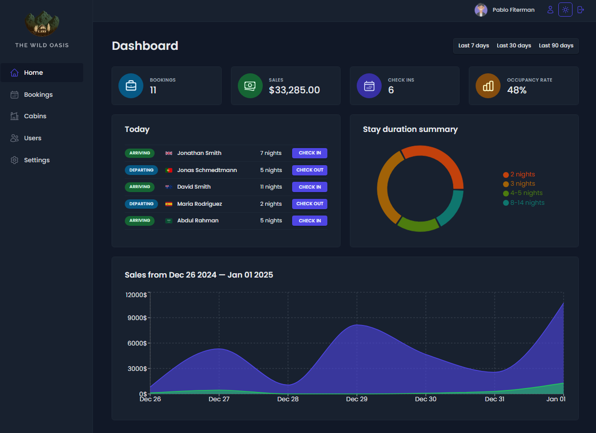

## 👋 Introduction

A user-friendly web application for managing hotel bookings including real-time availability, room details, secure booking processes, and an elegant, responsive design.



## 🌟 Features

- **Login** : User authentication ensures that only hotel employees can access the system.
- **Sign-up** : New users can be signed up only by authenticated users. They also need to confirm their email to start using the application.
- **Profile** : Employees can manage their profiles, including uploading avatars and changing passwords.
- **Settings** : Users can define a few application-wide settings such as breakfast price, etc.
- **Bookings** : Handle bookings with the ability to check guests in and out, and update booking statuses.
- **Cabin/Room** : Manage cabins with the ability to create, update, or delete cabin records.
- **Filtering** : Cabins and bookings can be sorted, filtered, and are paginated for easy navigation.
- **Dashboard** : Dashboard with charts to show statistics on recent bookings, sales, check-ins, and occupancy rate, which can be filtered by days.
- **Dark/Light Mode** : The app supports dark/light mode with automatic detection of the user's system settings.

## 👨‍💻 Technologies

- **React** : JavaScript library for UI development.
- **Supabase** : Cloud database service for real-time and secure data storage.
- **@tanstack/react-query** : Data-fetching and state management library for React.
- **date-fns** : JavaScript date utility library for parsing, formatting, and manipulating dates.
- **react-router-dom** : Library for routing and navigation in React apps.
- **recharts** : Composable charting library for React.
- **styled-components** : CSS-in-JS library for styling React components.
- **react-hot-toast** : Customizable toast notification library for React.
- **react-icons** : Collection of customizable icons for React apps.
- **react-hook-form** : Library for form state management and validation in React.

## 🎗️ Instalation Steps

1. Clone the repo:

```
git clone https://github.com/pfiterman/webAppWildOasisHotel.git
```

2. Install the required dependencies:

```
npm install
```

3. Run the developtment Server

```
npm run dev
```

4. Access the application

```
http://localhost:5173
```

## 🔒 Demo Credentials for Login in

You can access our application using the following demo account:

- User: guest@wildoasishotel.com
- Password: guest1234

## 💰 You can help me by Donating

[](https://buymeacoffee.com/pfiterman)
